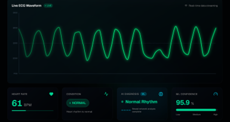
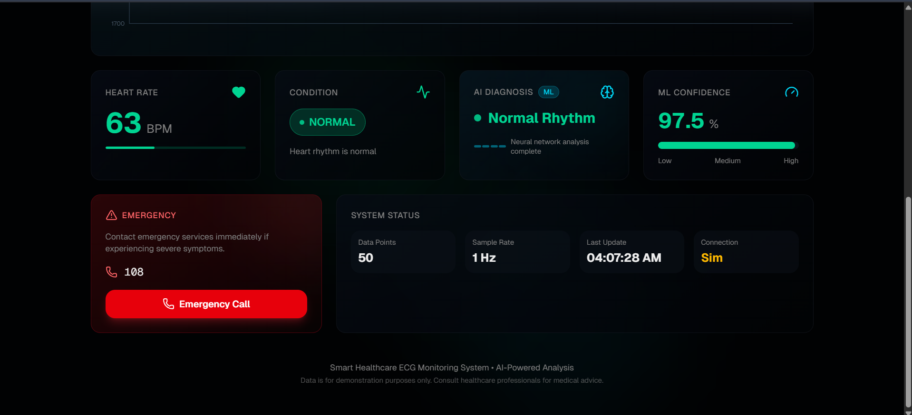
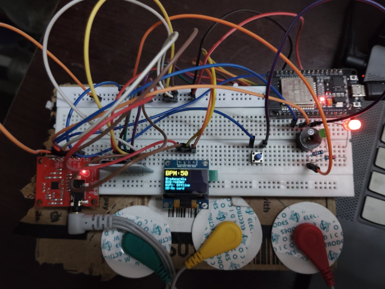
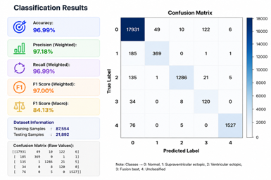

# ❤️ ECG AI Healthcare System

An AI-powered ECG monitoring platform that combines embedded systems, machine learning, and a modern web dashboard to analyze ECG signals and assist in cardiac arrhythmia classification.

<p align="center">

<a href="https://github.com/devexxxx/ECG-AI-Healthcare-System">GitHub</a> •
<a href="https://v0-ai-healthcare-dashboard-gamma.vercel.app/">Live Demo</a>

</p>

---

## 📖 Overview

This project was built to demonstrate how embedded hardware, machine learning, backend APIs, and a modern frontend can work together to create an intelligent healthcare solution.

ECG signals are acquired using an **ESP32** with an **AD8232 ECG sensor**, processed through a backend, analyzed by a machine learning model trained on real ECG data, and visualized on a responsive dashboard.

---

## ✨ Features

- ❤️ Real-time ECG monitoring
- 🤖 Machine learning-based heartbeat classification
- 📈 Interactive ECG waveform visualization
- 🌐 REST API for ECG prediction
- 💻 Responsive Next.js dashboard
- 🔌 ESP32 + AD8232 hardware integration
- 📊 Model performance evaluation
- ☁️ Live dashboard deployed on Vercel

---

# 🏗 System Architecture

<p align="center">

</p>

---

# 📸 Screenshots

## Dashboard

<p align="center">

</p>

---

## Prediction Dashboard

<p align="center">

</p>

---

## Hardware Setup

<p align="center">

</p>

---

## Model Performance

<p align="center">

</p>

---

# 📊 Machine Learning Performance

Dataset

- **Training Samples:** 87,554
- **Testing Samples:** 21,892
- **Total Samples:** 109,446

| Metric | Score |
|---------|-------:|
| Accuracy | **96.83%** |
| Weighted Precision | **97.23%** |
| Weighted Recall | **96.83%** |
| Weighted F1 Score | **96.98%** |
| Macro F1 Score | **83.90%** |

---

# 🧠 Tech Stack

### Embedded Systems

- ESP32
- AD8232 ECG Sensor
- Electrodes
- OLED Display

### Frontend

- Next.js
- React
- HTML
- CSS
- JavaScript

### Backend

- Node.js
- Express.js
- REST APIs

### Machine Learning

- Python
- Scikit-learn
- TensorFlow
- NumPy
- Pandas

### Deployment

- Vercel

---

# 📂 Project Structure

```text
ECG-AI-Healthcare-System
│
├── ai-healthcare-dashboard/
├── ecg_backend/
├── ml_model/
├── docs/
│   └── screenshots/
├── README.md
└── .gitignore
```

---

# 🚀 Getting Started

Clone the repository

```bash
git clone https://github.com/devexxxx/ECG-AI-Healthcare-System.git
```

Frontend

```bash
cd ai-healthcare-dashboard
npm install
npm run dev
```

Backend

```bash
cd ecg_backend
npm install
npm start
```

Machine Learning

```bash
cd ml_model
pip install -r requirements.txt
python train_model.py
```

---

# 🔮 Future Improvements

- Live ECG streaming from ESP32
- Deep learning models (CNN/LSTM)
- Patient authentication
- Historical ECG reports
- PDF report generation
- Cloud database integration
- Doctor dashboard
- Mobile application

---

# 👨‍💻 Author

**Devesh Gupta**

- GitHub: https://github.com/devexxxx
- LinkedIn: https://linkedin.com/in/devesh-gupta-04a83a276

---

⭐ If you found this project interesting, consider giving it a star.